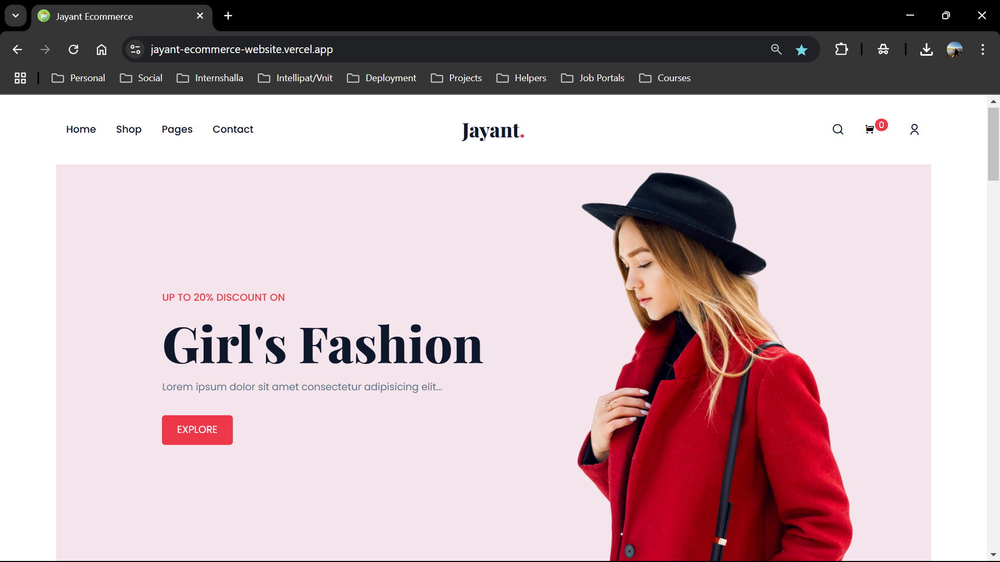

# Jayant Ecommerce Website

## Overview
Jayant E-Commerce Website is a full-stack MERN (MongoDB, Express.js, React, Node.js) application that provides a seamless online shopping experience. The project includes user authentication, cart functionality, and an intuitive user interface.

## Features
- **User Authentication** (Sign Up, Login, Logout, JWT Authentication)
- **Shopping Cart System** (Add, Remove, Update Quantities, Checkout)
- **Responsive Design** (Optimized for all devices)

## Future Features
- **Payment Integration** (Stripe / Razorpay)
- **Order Processing System**
- **Admin Dashboard**
- **Product Management**
- **Wishlist Feature**
- **User Reviews and Ratings**
- **Enhanced UI/UX**

## Tech Stack
### Frontend
- React.js
- Redux Toolkit
- Tailwind CSS
- React Router

### Backend
- Node.js
- Express.js
- MongoDB (Mongoose)
- JWT Authentication

---

## Installation

### Prerequisites
Ensure you have the following installed:
- **Node.js**
- **MongoDB**
- **npm**

### Steps to Run the Project

#### 1. Clone the Repository
```bash
git clone https://github.com/goyal1510/jayant-ecommerce-website.git
cd jayant-ecommerce-website
```

#### 2. Install Dependencies

**Backend**
```bash
cd backend
npm install
```

**Frontend**
```bash
cd frontend
npm install
```

#### 3. Configure Environment Variables

Create a `.env` file inside the `backend` directory and add the following variables:

```env
DB_URL=your_mongodb_connection_string
PORT=5000
JWT_SECRET=your_jwt_secret
FRONTEND_URL=http://localhost:5173
```

> ⚠️ Never commit your `.env` file to GitHub. Make sure it is included in `.gitignore`.

#### 4. Run the Application

**Start Backend Server**
```bash
cd backend
npm run start:dev
```

**Start Frontend Server**
```bash
cd frontend
npm start
```

---

## Screenshots


---

## Deployment
🔗 **Live Demo:**  
https://ecommerce.jayantgoyal.com/

---

## Contribution
Contributions are welcome!  
Feel free to fork this repository, open issues, or submit pull requests.

---

## Contact
For any queries or suggestions, reach out at:  
📧 **goyal151002@gmail.com**

---

## Security Note
Sensitive credentials have been removed from this repository.  
Always use environment variables and rotate secrets if they were previously exposed.
